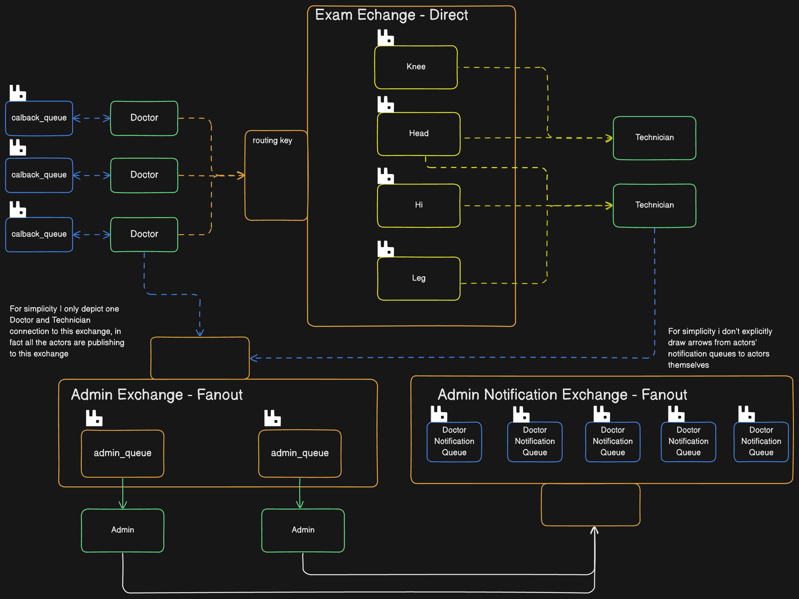

# Simple Asynchronous Doctor notification system
## System is based on RabbitMQ.

### Description
System enables to one run of 3 actors: `doctor`/`technician` or `admin`. Doctor requests examination reports
from technician, whereas admin documents all logs from different interactions in the distributed system. Admin is also enabled
to broadcast custom messages to the actors subscribing (`doctor` and `technician`).

I am utilizing RabbitMQ Exchanges, specifically `Direct` exchange for scheduling different examination requests
based on routing key (supported one of `hip`, `head`, `leg` and `knee`) and `Fanout` exchange for admin interaction
(both inbound and outbound).

### System design


### Instructions
After creating virtual env and installing required dependencies in order to run the program:

#### Start RabbitMQ server, hosted on docker container
```
docker compose up
```

#### Setup used Exchanges in the RabbitMQ
```
python setup_rabbitmq.py
```

#### Run your actor (one of `doctor`/`technician` or `admin`)
```
python main.py --actor [actor_type]
```


